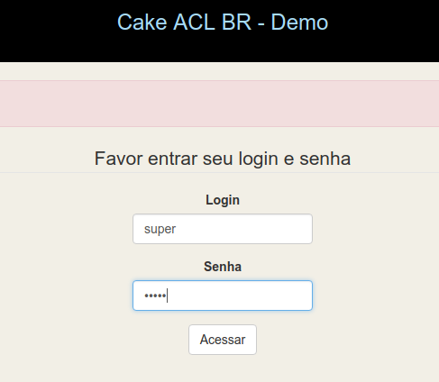
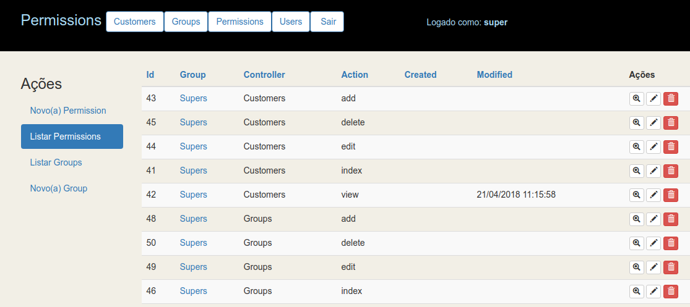
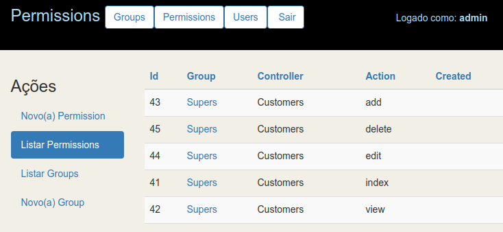
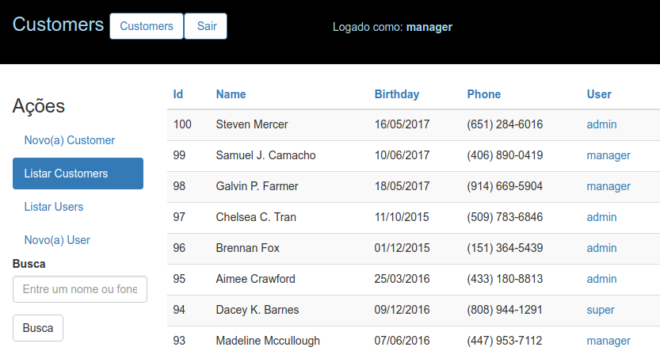
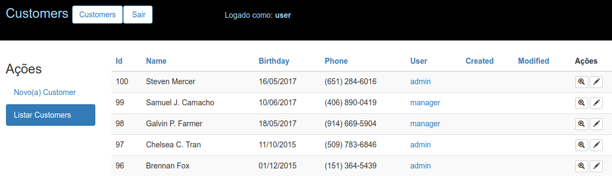
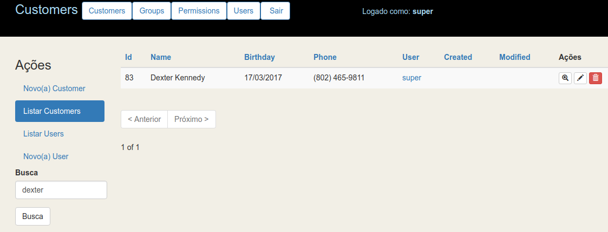
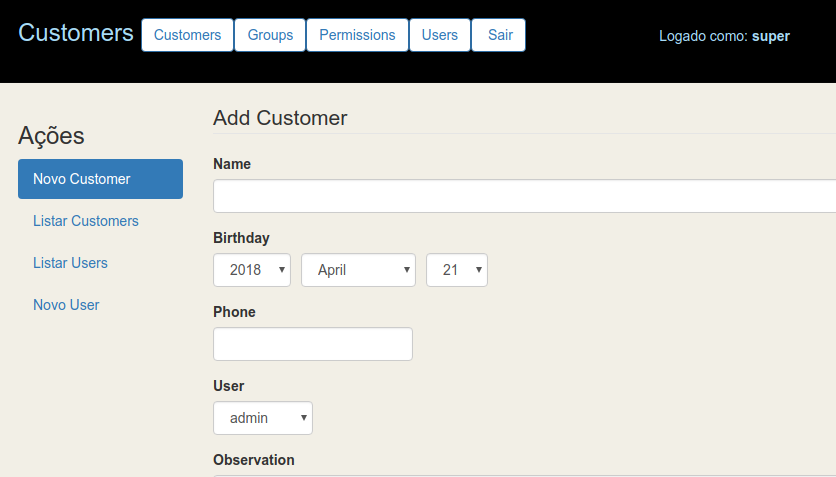
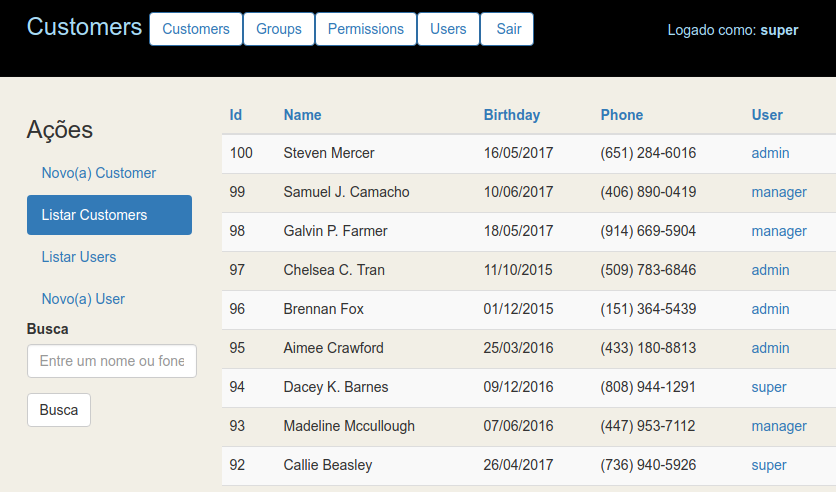
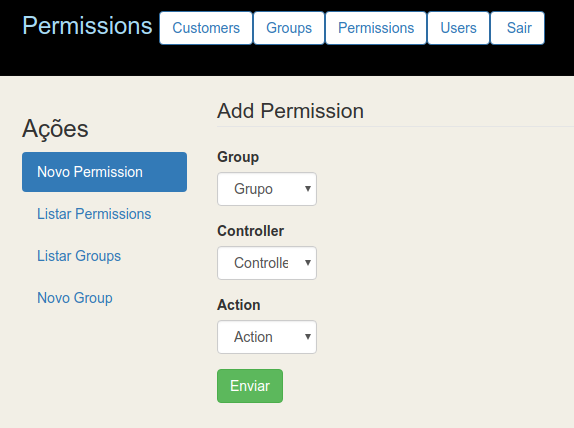

Plugin para Implementação de ACL no CakePHP 3
=============================================

Pois este ainda não está funcionando. Desculpe, estou corrigindo.

**Funciona somente com as versões:**
- PHP 7.2
- CakePHP 3.5.13 (https://github.com/cakephp/cakephp/releases/download/3.5.13/cakephp-3-5-13.zip)
Ainda não está compatível com a versão 3.6

# Demo
http://ribafs.org/demo/

O CakePHP 3.5.13 foi instalado juntamente com o plugin cake-acl-br e configurado para aceitar somente consultas do tipo select. Veja que quando tenta executar delete, update ou insert ele bloqueia e avisa que é apenas um demo. Consegui isso criando um banco e um usuário restrito e apenas com privilégios de select. E depois tratando as mensagens de erro e redirecionando para o logout. Você pode usar quanquer um dos usuários. É interessante que experimente todos os 4, para perceber a diferença de privilégios que eles têm e o ACL do plugin em ação.

Usuário - senha
- super - super (pode tudo)
- admin - admin (pode tudo mas somente nas tabelas groups, users e permissions)
- manager - manager (pode tudo mas somente nas tabelas de negócio, no caso customers)
- user - user (não pode quase nada, apenas efetuar login e visualizar a index de customers, nada mais)

Idealmente instale em um ambiente de testes para ter maior controle, pois o demos apenas permite selects nas tabelas.

## Continuação do cake-control-br
Este projeto basicamente continua de onde parou o cake-control-br. Este começa com a novidade de uma área para demo. Esta área permite dar uma olhada no plugin implementado e já ver alguma coisa para ver se vale a pena você instalar ou no.

URL deste projeto - https://github.com/ribafs/cake-acl-br/

Este plugin inclue o plugin BootstrapUI e o (Twitter) Bootstrap e também inclui os templates do bake do plugin [twbs-cake-plugin](https://github.com/elboletaire/twbs-cake-plugin).

## Principais recursos
    Template do bake traduzido para pt_BR
    Menu de topo com o element topmenu
    Busca com paginação
    Senhas criptografadas com Bcrypt
    Controle de Acesso tipo ACL com administração web
    Dois Layouts: admin e default com o Bootstrap
    Utilitários do BootstrapUI plugin

## Instalação e uso
https://github.com/ribafs/cake-acl-br

Criar app:

    Baixar o cake 3.5.13 daqui:
    https://github.com/cakephp/cakephp/releases/download/3.5.13/cakephp-3-5-13.zip
    Ou outra versão anterior. Enquanto o suporte ao Cake atual no sai.
    Descompacte para seu diretório web
    cd /var/www/html/acl1   
    
Instalar Plugin

    cd /var/www/html/acl1
    composer install
    composer require ribafs/cake-acl-br

## Configurar banco

Baixe o plugin, crie o banco e importe o script existente na pasta docs do plugin baixado. Depois edite config/app.php para configurar o banco.

Aproveite e configure também o controller default em config/routes.php para um de seu interesse.

## Habilitar o plugin

    bin/cake plugin load CakeAclBr --bootstrap

Download do plugin

    https://github.com/ribafs/cake-acl-br/archive/master.zip

Descompactar e abrir o diretório docs, então copiar:

    bootstrap_cli.php para a acl1/config (Com isso o Bake gerarará Users com login e logout)

    AppController.php para acl1/src/Controller

    cd acl1
    bin/cake bake all groups -t CakeAclBr
    bin/cake bake all users -t CakeAclBr
    bin/cake bake all permissions -t CakeAclBr
    bin/cake bake all customers -t CakeAclBr

## Concedendo permissões

- Comece fazendo login com user e user
- Veja que ele loga mas não tem acesso nem emsmo ao index de customers
- Faça logout
- Faça login com super ou admin
- Dando permissão para o usuário user acessar o controller Customer e action index
- Faça logout
- Faça login como user e veja que agora ele acessa a index do customers. Observe que não aparece o ícone para excluir os registros.
- Tente acessar qualquer outro action: edit, delete ou mesmo view. Observe também que vários outros recursos não aparecem para o 'user', busca, links, etc

## Controller default
Em AppController.php você pode definir o controller default para usuários não administradores. Caso não use a tabela customers troque logo no início do AppController por uma de suas tabelas na linha:

    protected $noAdmins = 'Customers';
    
## Algumas imagens/capturas

### Login

### Logado como super. Veja que o menu mostra todos os recursos

### Logado como admin. Veja que apenas groups, users e permissions

## Logado como manager. Apenas customers

### Logado como user. Apenas o index de customers e isso foi porque foi concedida esta permissão

### Busca

### Veja a customização do CSS do bootstrap

### Veja que em customers o user mostra o username ao invés de id, pois foi customizado o método displayField()

### Csutomização dos campos controller e actiion mudando de caixa de texto para combo

## Documentação
Alguns detalhes a mais - https://ribafs.github.io/cakephp/cake-acll.pdf

## Para usar a versão atual (3.6.1) do CakePHP
Após instalar o CakePHP 3.5.13 e instalar e habilitar o plugin cake-acl-br, instale o migrations

    composer require --update-with-dependencies "cakephp/cakephp:3.6.*"
Atualize o DebugKit

    composer require cakephp/debug_kit
    
Pronto, agora está com o CakePHP atualizado e o plugin cake-acl-br    

## Sugestões, colaborações e forks serão muto bem vindos:

- Erros: português
- PHP
- CakePHP
- ControlComponent.php
- Ou algo que queira me avisar...

License
-------

The MIT License (MIT)
